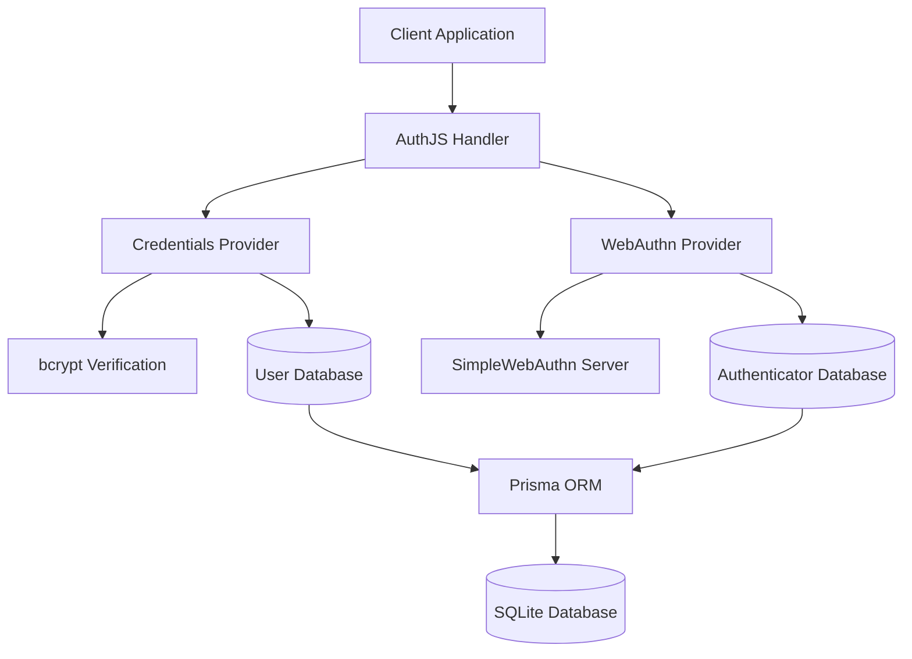
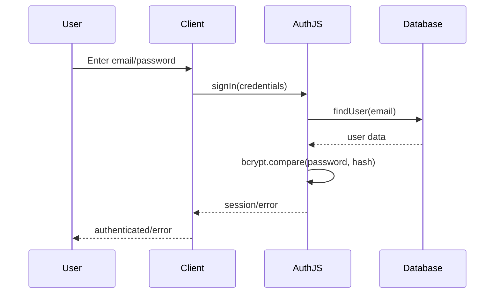
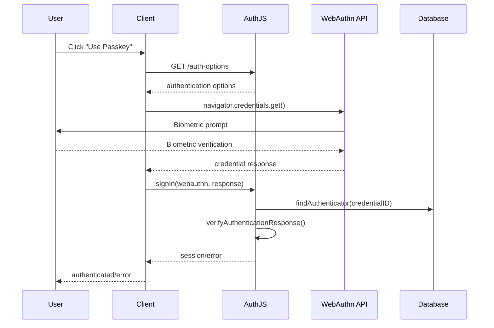

# Authentication System Overview

This document provides a comprehensive overview of the authentication system implemented in this Nuxt application using AuthJS.

## 🏗️ Architecture

The authentication system is built on top of **AuthJS (formerly NextAuth.js)** with the **@hebilicious/authjs-nuxt** module, providing a robust and secure authentication solution for Nuxt applications.

### Core Components



## 🔐 Authentication Methods

### 1. Password Authentication
- **Traditional email/password** authentication
- **bcrypt hashing** with 12 salt rounds
- **User lookup** via Prisma ORM
- **Credential validation** with secure comparison

### 2. WebAuthn/Passkey Authentication
- **Modern biometric authentication** (Touch ID, Face ID, Windows Hello)
- **Hardware security keys** support
- **Passwordless authentication** experience
- **FIDO2/WebAuthn standards** compliance

## 🔧 Technical Implementation

### AuthJS Configuration

```typescript
// server/api/auth/[...].ts
export const authOptions: AuthConfig = {
  secret: process.env.NUXT_AUTH_SECRET,
  providers: [
    CredentialsProvider({ /* password auth */ }),
    CredentialsProvider({ /* webauthn auth */ })
  ],
  callbacks: {
    jwt: { /* token handling */ },
    session: { /* session management */ }
  },
  pages: {
    signIn: '/auth/signin',
    signUp: '/auth/signup'
  }
}
```

### Database Schema

```prisma
model User {
  id            String          @id @default(cuid())
  email         String          @unique
  password      String?         // For password auth
  name          String?
  emailVerified DateTime?
  image         String?

  // Relations
  accounts      Account[]
  sessions      Session[]
  authenticators Authenticator[] // For WebAuthn

  createdAt DateTime @default(now())
  updatedAt DateTime @updatedAt
}

model Authenticator {
  id                   String  @id @default(cuid())
  credentialID         Bytes   @unique
  credentialPublicKey  Bytes
  counter              Int
  transports           String[]

  // Relations
  userId String
  user   User   @relation(fields: [userId], references: [id], onDelete: Cascade)

  createdAt DateTime @default(now())
  updatedAt DateTime @updatedAt
}
```

## 🔄 Authentication Flow

### Password Authentication Flow



### WebAuthn Authentication Flow



## 🛡️ Security Features

### Password Security
- **bcrypt hashing** with 12 salt rounds (2^12 = 4,096 iterations)
- **Secure password comparison** using bcrypt.compare()
- **No plaintext password storage** in database
- **Password complexity** can be enforced client-side

### WebAuthn Security
- **Public key cryptography** for authentication
- **Biometric verification** (where supported)
- **Replay attack prevention** via challenge-response
- **Counter verification** to detect cloned authenticators
- **Origin validation** to prevent phishing

### Session Security
- **JWT-based sessions** with secure secrets
- **CSRF protection** built into AuthJS
- **Secure cookie settings** for production
- **Session expiration** and refresh handling

## 📊 Session Management

### Session Structure
```typescript
interface Session {
  user: {
    id: string
    email: string
    name?: string
  }
  expires: string
}
```

### JWT Token
```typescript
interface JWT {
  id: string           // User ID
  email: string        // User email
  name?: string        // User name
  iat: number         // Issued at
  exp: number         // Expires at
}
```

## 🔗 API Endpoints

| Endpoint | Method | Purpose |
|----------|--------|---------|
| `/api/auth/signin` | POST | Sign in with credentials |
| `/api/auth/signout` | POST | Sign out user |
| `/api/auth/session` | GET | Get current session |
| `/api/auth/register` | POST | Register new user |
| `/api/auth/webauthn/register-options` | POST | Get WebAuthn registration options |
| `/api/auth/webauthn/verify-registration` | POST | Verify WebAuthn registration |
| `/api/auth/webauthn/auth-options` | POST | Get WebAuthn authentication options |

## 🧪 Testing Strategy

### Test Coverage
- **Password Authentication**: 10 tests
- **WebAuthn Authentication**: 10 tests
- **API Endpoints**: 13 tests
- **Middleware**: 17 tests
- **Total**: 50 tests

### Test Categories
1. **Unit Tests** - Individual function testing
2. **Integration Tests** - API endpoint testing
3. **Authentication Flow Tests** - Complete auth flows
4. **Security Tests** - Password hashing, token validation
5. **Error Handling Tests** - Various failure scenarios

## 🚀 Performance Considerations

### Optimization Strategies
- **Connection pooling** with Prisma
- **Password hashing** done asynchronously
- **WebAuthn verification** optimized with SimpleWebAuthn
- **Session caching** via AuthJS
- **Database indexing** on email and credentialID

### Scalability
- **Stateless JWT sessions** for horizontal scaling
- **Database optimization** with proper indexes
- **Rate limiting** can be added for protection
- **CDN compatibility** for session management

## 🔧 Configuration

### Environment Variables
```env
# Required
NUXT_AUTH_SECRET="your-super-secret-key"
NUXT_AUTH_URL="http://localhost:3000"
DATABASE_URL="file:./db/dev.db"

# Optional (for production)
NUXT_WEBAUTHN_RP_NAME="Your App Name"
NUXT_WEBAUTHN_RP_ID="yourdomain.com"
NUXT_WEBAUTHN_ORIGIN="https://yourdomain.com"
```

### Nuxt Configuration
```typescript
// nuxt.config.ts
export default defineNuxtConfig({
  modules: ['@hebilicious/authjs-nuxt'],
  runtimeConfig: {
    authJs: {
      secret: process.env.NUXT_AUTH_SECRET
    },
    public: {
      authJs: {
        baseUrl: process.env.NUXT_AUTH_URL,
        verifyClientOnEveryRequest: true
      }
    }
  }
})
```

## 📈 Future Enhancements

### Planned Features
- [ ] **OAuth providers** (Google, GitHub, etc.)
- [ ] **Multi-factor authentication** (TOTP, SMS)
- [ ] **Account linking** between providers
- [ ] **Admin dashboard** for user management
- [ ] **Audit logging** for security events

### UI Components (Not Implemented)
- [ ] Sign-in page with both auth methods
- [ ] Sign-up page with registration flow
- [ ] User profile management
- [ ] Authenticator management (add/remove passkeys)
- [ ] Account settings and preferences

## 🐛 Troubleshooting

### Common Issues
1. **Import errors** - Ensure all dependencies are installed
2. **Database errors** - Run `npx prisma db push`
3. **Auth secret missing** - Set `NUXT_AUTH_SECRET` in `.env`
4. **WebAuthn not working** - Check HTTPS requirement in production

### Debug Tips
- Enable AuthJS debug mode with `NEXTAUTH_DEBUG=true`
- Check browser console for WebAuthn errors
- Verify database connections with Prisma Studio
- Test API endpoints directly with tools like Postman

For more specific implementation details, see the individual documentation files for each authentication method.