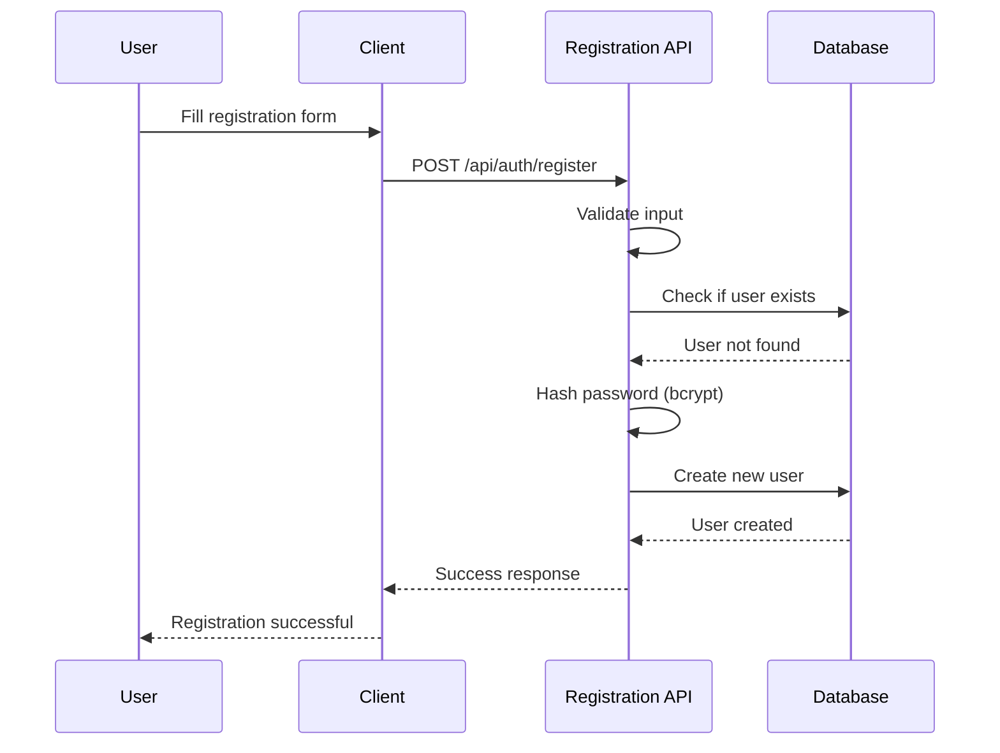
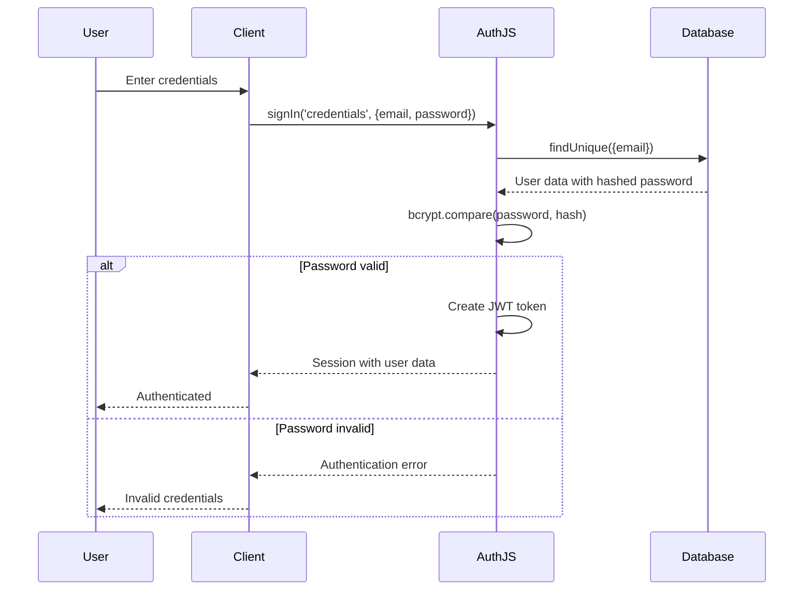

# Password Authentication Implementation

This document details the implementation of traditional email/password authentication in our Nuxt application.

## 🔧 Implementation Overview

Password authentication is implemented using the **Credentials Provider** from AuthJS, with **bcrypt** for password hashing and **Prisma** for database operations.

## 🏗️ Core Components

### 1. User Registration

#### API Endpoint: `POST /api/auth/register`

```typescript
// server/api/auth/register.post.ts
export default defineEventHandler(async (event) => {
  const { email, password, name } = await readBody(event)

  // Validation
  if (!email || !password) {
    throw createError({
      statusCode: 400,
      statusMessage: 'Email and password are required'
    })
  }

  // Check for existing user
  const existingUser = await prisma.user.findUnique({
    where: { email }
  })

  if (existingUser) {
    throw createError({
      statusCode: 409,
      statusMessage: 'User already exists'
    })
  }

  // Hash password and create user
  const hashedPassword = await bcrypt.hash(password, 12)
  const user = await prisma.user.create({
    data: {
      email,
      password: hashedPassword,
      name: name || null,
      emailVerified: null
    }
  })

  return {
    success: true,
    user: {
      id: user.id,
      email: user.email,
      name: user.name
    }
  }
})
```

#### Key Features:
- **Email uniqueness validation**
- **Password hashing** with bcrypt (12 salt rounds)
- **Input validation** for required fields
- **Error handling** for duplicate accounts
- **Secure response** (no password in response)

### 2. User Authentication

#### AuthJS Credentials Provider

```typescript
// server/api/auth/[...].ts
CredentialsProvider({
  id: 'credentials',
  name: 'Email and Password',
  credentials: {
    email: { label: 'Email', type: 'email' },
    password: { label: 'Password', type: 'password' }
  },
  async authorize(credentials) {
    if (!credentials?.email || !credentials?.password) {
      return null
    }

    try {
      // Find user in database
      const user = await prisma.user.findUnique({
        where: { email: credentials.email }
      })

      if (!user || !user.password) {
        return null
      }

      // Verify password
      const isValidPassword = await bcrypt.compare(
        credentials.password,
        user.password
      )

      if (!isValidPassword) {
        return null
      }

      // Return user data for session
      return {
        id: user.id,
        email: user.email,
        name: user.name,
      }
    } catch (error) {
      console.error('Authentication error:', error)
      return null
    }
  }
})
```

#### Key Features:
- **Secure password comparison** using bcrypt.compare()
- **User lookup** by email
- **Error handling** for all failure cases
- **Session data preparation** (excluding sensitive information)

## 🔒 Security Implementation

### Password Hashing

```typescript
// Registration - Hash password
const saltRounds = 12
const hashedPassword = await bcrypt.hash(password, saltRounds)

// Authentication - Verify password
const isValidPassword = await bcrypt.compare(password, hashedPassword)
```

#### Security Features:
- **bcrypt algorithm** - Industry standard for password hashing
- **12 salt rounds** - 2^12 = 4,096 iterations for strong security
- **Unique salts** - Each password gets a unique salt
- **Constant-time comparison** - Prevents timing attacks

### Input Validation

```typescript
// Basic validation
if (!email || !password) {
  throw createError({
    statusCode: 400,
    statusMessage: 'Email and password are required'
  })
}

// Email format validation (can be added)
const emailRegex = /^[^\s@]+@[^\s@]+\.[^\s@]+$/
if (!emailRegex.test(email)) {
  throw createError({
    statusCode: 400,
    statusMessage: 'Invalid email format'
  })
}

// Password complexity (can be added)
if (password.length < 8) {
  throw createError({
    statusCode: 400,
    statusMessage: 'Password must be at least 8 characters'
  })
}
```

## 📊 Database Schema

### User Model

```prisma
model User {
  id            String    @id @default(cuid())
  email         String    @unique
  password      String?   // Nullable for OAuth-only users
  name          String?
  emailVerified DateTime?
  image         String?

  // Authentication relations
  accounts      Account[]
  sessions      Session[]
  authenticators Authenticator[]

  createdAt DateTime @default(now())
  updatedAt DateTime @updatedAt

  @@map("users")
}
```

#### Key Fields:
- **`id`** - Unique identifier (cuid)
- **`email`** - Unique email address (indexed)
- **`password`** - bcrypt hashed password (nullable)
- **`name`** - Optional display name
- **`emailVerified`** - Email verification timestamp
- **`createdAt/updatedAt`** - Automatic timestamps

## 🔄 Authentication Flow

### Registration Flow



### Login Flow



## 🧪 Testing

### Test Coverage

```typescript
// tests/auth/password.test.ts
describe('Password Authentication', () => {
  describe('User Registration', () => {
    it('should hash password correctly')
    it('should verify password hash correctly')
    it('should create user with hashed password')
    it('should not create user with duplicate email')
  })

  describe('User Authentication', () => {
    it('should authenticate user with correct credentials')
    it('should reject authentication with incorrect password')
    it('should reject authentication for non-existent user')
    it('should handle missing credentials')
  })

  describe('Password Validation', () => {
    it('should require minimum password length')
    it('should handle password complexity requirements')
  })
})
```

### Test Examples

```typescript
// Password hashing test
it('should hash password correctly', async () => {
  const password = 'testPassword123'
  const hashedPassword = await bcrypt.hash(password, 12)

  expect(hashedPassword).not.toBe(password)
  expect(hashedPassword).toMatch(/^\$2[aby]\$12\$/)
})

// Authentication test
it('should authenticate user with correct credentials', async () => {
  const email = 'test@example.com'
  const password = 'testPassword123'
  const hashedPassword = await bcrypt.hash(password, 12)

  const mockUser = {
    id: '1',
    email,
    name: 'Test User',
    password: hashedPassword
  }

  vi.mocked(mockPrisma.user.findUnique).mockResolvedValue(mockUser)

  const user = await mockPrisma.user.findUnique({ where: { email } })
  const isValidPassword = await bcrypt.compare(password, user.password)

  expect(isValidPassword).toBe(true)
})
```

## 🔧 Configuration

### Environment Variables

```env
# Required for password hashing performance
BCRYPT_ROUNDS=12

# Database connection
DATABASE_URL="file:./db/dev.db"

# AuthJS configuration
NUXT_AUTH_SECRET="your-super-secret-key"
```

### Bcrypt Configuration

```typescript
// Adjustable security level
const saltRounds = process.env.BCRYPT_ROUNDS
  ? parseInt(process.env.BCRYPT_ROUNDS)
  : 12

// Production considerations
// 10 rounds: ~100ms per hash (minimum recommended)
// 12 rounds: ~300ms per hash (current setting)
// 14 rounds: ~1000ms per hash (high security)
```

## 🚀 Performance Considerations

### Password Hashing Performance

| Salt Rounds | Time (approx) | Security Level |
|-------------|---------------|----------------|
| 10          | ~100ms        | Minimum        |
| 12          | ~300ms        | Recommended    |
| 14          | ~1000ms       | High Security  |
| 16          | ~4000ms       | Paranoid       |

### Optimization Strategies

1. **Async Operations**
   ```typescript
   // Always use async bcrypt operations
   const hash = await bcrypt.hash(password, 12)
   const isValid = await bcrypt.compare(password, hash)
   ```

2. **Connection Pooling**
   ```typescript
   // Prisma handles connection pooling automatically
   const prisma = new PrismaClient()
   ```

3. **Database Indexing**
   ```prisma
   model User {
     email String @unique // Automatic index on email
   }
   ```

## ⚠️ Security Considerations

### Best Practices

1. **Never Log Passwords**
   ```typescript
   // ❌ Bad
   console.log('User login attempt:', { email, password })

   // ✅ Good
   console.log('User login attempt:', { email })
   ```

2. **Secure Error Messages**
   ```typescript
   // ❌ Bad - Reveals if email exists
   if (!user) return 'User not found'
   if (!isValidPassword) return 'Invalid password'

   // ✅ Good - Generic message
   if (!user || !isValidPassword) return 'Invalid credentials'
   ```

3. **Rate Limiting** (Future Enhancement)
   ```typescript
   // Implement rate limiting for login attempts
   const rateLimiter = rateLimit({
     windowMs: 15 * 60 * 1000, // 15 minutes
     max: 5 // limit each IP to 5 requests per windowMs
   })
   ```

### Common Vulnerabilities

| Vulnerability | Prevention |
|---------------|------------|
| **Password Storage** | Use bcrypt, never store plaintext |
| **Timing Attacks** | Use bcrypt.compare() for constant-time comparison |
| **Brute Force** | Implement rate limiting (future enhancement) |
| **SQL Injection** | Use Prisma ORM with parameterized queries |
| **User Enumeration** | Use generic error messages |

## 🐛 Troubleshooting

### Common Issues

1. **bcrypt Installation**
   ```bash
   # If bcrypt fails to install
   npm rebuild bcrypt
   # or
   pnpm add bcrypt --save
   ```

2. **Database Connection**
   ```bash
   # Reset database
   npx prisma db push --force-reset
   npx prisma generate
   ```

3. **Authentication Failures**
   ```typescript
   // Debug authentication
   console.log('User found:', !!user)
   console.log('Password exists:', !!user?.password)
   console.log('Password valid:', isValidPassword)
   ```

### Error Messages

| Error | Cause | Solution |
|-------|-------|----------|
| `User already exists` | Duplicate email | Use different email or implement login |
| `Invalid credentials` | Wrong email/password | Check credentials |
| `Internal server error` | Database/bcrypt error | Check logs and database connection |

## 📈 Future Enhancements

### Planned Features

1. **Password Reset**
   - Email-based password reset
   - Secure token generation
   - Time-limited reset links

2. **Password Policies**
   - Minimum length requirements
   - Complexity rules (uppercase, numbers, symbols)
   - Password history prevention

3. **Account Security**
   - Login history tracking
   - Suspicious activity detection
   - Account lockout after failed attempts

4. **Email Verification**
   - Email confirmation on registration
   - Email change verification
   - Resend verification emails

### Implementation Examples

```typescript
// Password complexity validation
function validatePassword(password: string): boolean {
  const minLength = 8
  const hasUpperCase = /[A-Z]/.test(password)
  const hasLowerCase = /[a-z]/.test(password)
  const hasNumbers = /\d/.test(password)
  const hasSymbols = /[!@#$%^&*(),.?":{}|<>]/.test(password)

  return password.length >= minLength &&
         hasUpperCase &&
         hasLowerCase &&
         hasNumbers &&
         hasSymbols
}

// Password reset token generation
function generateResetToken(): string {
  return crypto.randomBytes(32).toString('hex')
}
```

This password authentication system provides a solid foundation for secure user authentication while maintaining good performance and user experience.