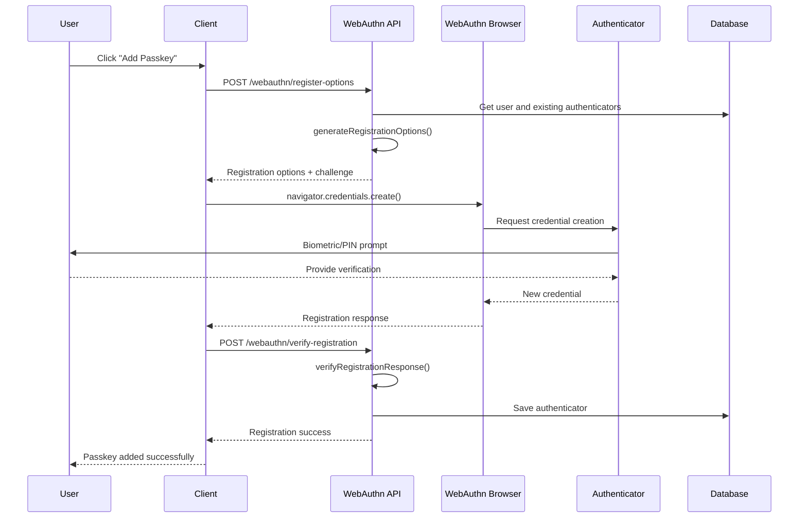
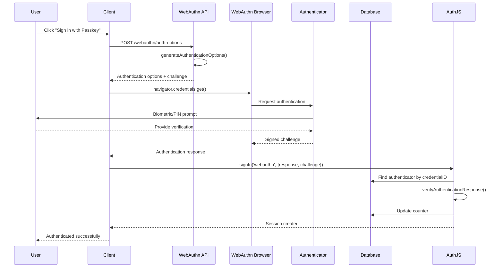

# WebAuthn/Passkey Authentication Implementation

This document details the implementation of WebAuthn (Web Authentication) and passkey authentication in our Nuxt application using SimpleWebAuthn.

## 🔧 Implementation Overview

WebAuthn authentication is implemented using:
- **SimpleWebAuthn** library for server-side verification
- **AuthJS Credentials Provider** for integration
- **Prisma** for authenticator storage
- **Browser WebAuthn API** for client-side operations

## 🏗️ Core Components

### 1. Authenticator Registration

#### API Endpoint: `POST /api/auth/webauthn/register-options`

```typescript
// server/api/auth/webauthn/register-options.post.ts
export default defineEventHandler(async (event) => {
  const { userID } = await readBody(event)

  // Get user and existing authenticators
  const user = await prisma.user.findUnique({
    where: { id: userID },
    include: { authenticators: true }
  })

  // Map existing authenticators to exclude from registration
  const existingAuthenticators = user.authenticators.map(auth => ({
    credentialID: auth.credentialID,
    credentialPublicKey: auth.credentialPublicKey,
    counter: auth.counter,
    transports: auth.transports as AuthenticatorTransport[]
  }))

  // Generate registration options
  const options = await generateRegistrationOptions({
    rpName: 'Cuddly Nuxt App',
    rpID: 'localhost', // Use your domain in production
    userID: user.id,
    userName: user.email,
    userDisplayName: user.name || user.email,
    attestationType: 'none',
    excludeCredentials: existingAuthenticators.map(auth => ({
      id: auth.credentialID,
      type: 'public-key',
      transports: auth.transports,
    })),
    authenticatorSelection: {
      residentKey: 'preferred',
      userVerification: 'preferred',
      authenticatorAttachment: 'platform', // Prefer built-in authenticators
    },
  })

  return { options, challenge: options.challenge }
})
```

#### API Endpoint: `POST /api/auth/webauthn/verify-registration`

```typescript
// server/api/auth/webauthn/verify-registration.post.ts
export default defineEventHandler(async (event) => {
  const { userID, response, expectedChallenge } = await readBody(event)

  // Verify the registration response
  const verification = await verifyRegistrationResponse({
    response,
    expectedChallenge,
    expectedOrigin: 'http://localhost:3000',
    expectedRPID: 'localhost'
  })

  if (!verification.verified || !verification.registrationInfo) {
    throw createError({
      statusCode: 400,
      statusMessage: 'Registration verification failed'
    })
  }

  const { registrationInfo } = verification

  // Save the authenticator to the database
  const authenticator = await prisma.authenticator.create({
    data: {
      credentialID: registrationInfo.credentialID,
      credentialPublicKey: registrationInfo.credentialPublicKey,
      counter: registrationInfo.counter,
      transports: response.response.transports || [],
      userId: userID
    }
  })

  return {
    success: true,
    verified: verification.verified,
    authenticator: {
      id: authenticator.id,
      credentialID: authenticator.credentialID.toString('base64url')
    }
  }
})
```

### 2. Authentication Options & Verification

#### API Endpoint: `POST /api/auth/webauthn/auth-options`

```typescript
// server/api/auth/webauthn/auth-options.post.ts
export default defineEventHandler(async (event) => {
  const { userEmail } = await readBody(event)

  let allowCredentials = undefined

  // If userEmail provided, get user's existing authenticators
  if (userEmail) {
    const user = await prisma.user.findUnique({
      where: { email: userEmail },
      include: { authenticators: true }
    })

    if (user && user.authenticators.length > 0) {
      allowCredentials = user.authenticators.map(authenticator => ({
        id: authenticator.credentialID,
        type: 'public-key' as const,
        transports: authenticator.transports as AuthenticatorTransport[]
      }))
    }
  }

  const options = await generateAuthenticationOptions({
    rpID: 'localhost',
    userVerification: 'preferred',
    allowCredentials
  })

  return { options, challenge: options.challenge }
})
```

### 3. AuthJS Integration

#### WebAuthn Credentials Provider

```typescript
// server/api/auth/[...].ts
CredentialsProvider({
  id: 'webauthn',
  name: 'Passkey',
  credentials: {
    response: { label: 'WebAuthn Response', type: 'text' },
    challenge: { label: 'Challenge', type: 'text' }
  },
  async authorize(credentials) {
    if (!credentials?.response || !credentials?.challenge) {
      return null
    }

    try {
      const webauthnResponse = JSON.parse(credentials.response)
      const expectedChallenge = credentials.challenge

      // Find the authenticator in the database
      const authenticator = await prisma.authenticator.findUnique({
        where: { credentialID: Buffer.from(webauthnResponse.id, 'base64url') },
        include: { user: true }
      })

      if (!authenticator) {
        return null
      }

      // Verify the authentication response
      const verification = await verifyAuthenticationResponse({
        response: webauthnResponse,
        expectedChallenge,
        expectedOrigin: 'http://localhost:3000',
        expectedRPID: 'localhost',
        authenticator: {
          credentialID: authenticator.credentialID,
          credentialPublicKey: authenticator.credentialPublicKey,
          counter: authenticator.counter
        }
      })

      if (verification.verified) {
        // Update the counter to prevent replay attacks
        await prisma.authenticator.update({
          where: { credentialID: authenticator.credentialID },
          data: { counter: verification.authenticationInfo.newCounter }
        })

        return {
          id: authenticator.user.id,
          email: authenticator.user.email,
          name: authenticator.user.name,
        }
      }

      return null
    } catch (error) {
      console.error('WebAuthn authentication error:', error)
      return null
    }
  }
})
```

## 🔒 Security Implementation

### Public Key Cryptography

WebAuthn uses **asymmetric cryptography**:
- **Private key** stored securely on the authenticator device
- **Public key** stored in our database
- **Digital signatures** for authentication verification

### Anti-Replay Protection

```typescript
// Counter verification prevents replay attacks
const currentCounter = authenticator.counter
const newCounter = verification.authenticationInfo.newCounter

if (newCounter <= currentCounter) {
  // Potential replay attack or cloned authenticator
  throw new Error('Invalid counter value')
}

// Update counter after successful verification
await prisma.authenticator.update({
  where: { credentialID: authenticator.credentialID },
  data: { counter: newCounter }
})
```

### Challenge-Response

```typescript
// Each authentication requires a unique challenge
const options = await generateAuthenticationOptions({
  rpID: 'localhost',
  userVerification: 'preferred'
})

// Challenge must be verified during authentication
const verification = await verifyAuthenticationResponse({
  response: webauthnResponse,
  expectedChallenge: storedChallenge, // Must match
  expectedOrigin: 'http://localhost:3000',
  expectedRPID: 'localhost'
})
```

## 📊 Database Schema

### Authenticator Model

```prisma
model Authenticator {
  id                   String   @id @default(cuid())
  credentialID         Bytes    @unique
  credentialPublicKey  Bytes
  counter              Int
  transports           String[]

  // Relations
  userId String
  user   User   @relation(fields: [userId], references: [id], onDelete: Cascade)

  createdAt DateTime @default(now())
  updatedAt DateTime @updatedAt

  @@map("authenticators")
}
```

#### Key Fields:
- **`credentialID`** - Unique identifier for the credential (indexed)
- **`credentialPublicKey`** - Public key for signature verification
- **`counter`** - Signature counter for replay attack prevention
- **`transports`** - Available transport methods (USB, NFC, BLE, internal)
- **`userId`** - Foreign key to associated user

### User Relationship

```prisma
model User {
  id             String          @id @default(cuid())
  email          String          @unique
  authenticators Authenticator[] // One-to-many relationship

  // ... other fields
}
```

## 🔄 Authentication Flow

### Registration Flow



### Authentication Flow



## 🧪 Testing

### Test Coverage

```typescript
// tests/auth/webauthn.test.ts
describe('WebAuthn/Passkey Authentication', () => {
  describe('Registration Options Generation', () => {
    it('should generate registration options for new user')
    it('should exclude existing authenticators from registration')
  })

  describe('Registration Verification', () => {
    it('should verify valid registration response')
    it('should reject invalid registration response')
  })

  describe('Authentication Options Generation', () => {
    it('should generate authentication options')
  })

  describe('Authentication Verification', () => {
    it('should verify valid authentication response')
    it('should update authenticator counter after successful authentication')
    it('should reject authentication for non-existent authenticator')
  })

  describe('Authenticator Management', () => {
    it('should store new authenticator after successful registration')
    it('should retrieve user authenticators')
  })
})
```

### Mock Testing

```typescript
// Mock SimpleWebAuthn functions
vi.mock('@simplewebauthn/server', () => ({
  generateRegistrationOptions: vi.fn(),
  verifyRegistrationResponse: vi.fn(),
  generateAuthenticationOptions: vi.fn(),
  verifyAuthenticationResponse: vi.fn()
}))

// Test registration options
it('should generate registration options for new user', async () => {
  const mockOptions = {
    challenge: 'mock-challenge-string',
    rp: { name: 'Cuddly Nuxt App', id: 'localhost' },
    user: { id: 'user-123', name: 'test@example.com', displayName: 'Test User' },
    pubKeyCredParams: [{ alg: -7, type: 'public-key' }],
    authenticatorSelection: {
      authenticatorAttachment: 'platform',
      residentKey: 'preferred',
      userVerification: 'preferred'
    }
  }

  vi.mocked(generateRegistrationOptions).mockResolvedValue(mockOptions)

  const options = await generateRegistrationOptions({
    rpName: 'Cuddly Nuxt App',
    rpID: 'localhost',
    userID: 'user-123',
    userName: 'test@example.com',
    userDisplayName: 'Test User'
  })

  expect(options.challenge).toBeTruthy()
  expect(options.rp.name).toBe('Cuddly Nuxt App')
})
```

## 🔧 Configuration

### Environment Variables

```env
# Production WebAuthn configuration
NUXT_WEBAUTHN_RP_NAME="Your App Name"
NUXT_WEBAUTHN_RP_ID="yourdomain.com"
NUXT_WEBAUTHN_ORIGIN="https://yourdomain.com"

# Development (default values)
NUXT_WEBAUTHN_RP_NAME="Cuddly Nuxt App"
NUXT_WEBAUTHN_RP_ID="localhost"
NUXT_WEBAUTHN_ORIGIN="http://localhost:3000"
```

### Dynamic Configuration

```typescript
// server/api/auth/webauthn/config.ts
const rpName = process.env.NUXT_WEBAUTHN_RP_NAME || 'Cuddly Nuxt App'
const rpID = process.env.NODE_ENV === 'production'
  ? process.env.NUXT_WEBAUTHN_RP_ID || 'yourdomain.com'
  : 'localhost'
const origin = process.env.NODE_ENV === 'production'
  ? process.env.NUXT_WEBAUTHN_ORIGIN || 'https://yourdomain.com'
  : 'http://localhost:3000'

export { rpName, rpID, origin }
```

## 🌐 Client-Side Implementation

### WebAuthn Browser API Usage

```typescript
// Registration flow (client-side)
async function registerPasskey(userId: string) {
  // Get registration options from server
  const { options } = await $fetch('/api/auth/webauthn/register-options', {
    method: 'POST',
    body: { userID: userId }
  })

  // Create credential using browser WebAuthn API
  const credential = await navigator.credentials.create({
    publicKey: options
  })

  // Send credential to server for verification
  const result = await $fetch('/api/auth/webauthn/verify-registration', {
    method: 'POST',
    body: {
      userID: userId,
      response: credential,
      expectedChallenge: options.challenge
    }
  })

  return result
}

// Authentication flow (client-side)
async function authenticateWithPasskey(userEmail?: string) {
  // Get authentication options from server
  const { options, challenge } = await $fetch('/api/auth/webauthn/auth-options', {
    method: 'POST',
    body: { userEmail }
  })

  // Get credential using browser WebAuthn API
  const credential = await navigator.credentials.get({
    publicKey: options
  })

  // Sign in using AuthJS
  const result = await signIn('webauthn', {
    response: JSON.stringify(credential),
    challenge: challenge,
    redirect: false
  })

  return result
}
```

### Error Handling

```typescript
// Handle WebAuthn errors
try {
  const credential = await navigator.credentials.create({ publicKey: options })
} catch (error) {
  if (error.name === 'NotSupportedError') {
    throw new Error('WebAuthn is not supported on this device')
  } else if (error.name === 'SecurityError') {
    throw new Error('WebAuthn operation failed due to security restrictions')
  } else if (error.name === 'NotAllowedError') {
    throw new Error('User cancelled the WebAuthn operation')
  } else {
    throw new Error('WebAuthn operation failed')
  }
}
```

## 🚀 Performance Considerations

### Optimizations

1. **Credential Exclusion**
   ```typescript
   // Prevent re-registration of existing authenticators
   excludeCredentials: existingAuthenticators.map(auth => ({
     id: auth.credentialID,
     type: 'public-key',
     transports: auth.transports
   }))
   ```

2. **Transport Optimization**
   ```typescript
   // Prefer platform authenticators (Touch ID, Face ID, Windows Hello)
   authenticatorSelection: {
     authenticatorAttachment: 'platform',
     residentKey: 'preferred',
     userVerification: 'preferred'
   }
   ```

3. **Database Indexing**
   ```prisma
   model Authenticator {
     credentialID Bytes @unique // Automatic index for fast lookups
   }
   ```

### Caching Strategies

```typescript
// Cache authentication options for better UX
const authOptionsCache = new Map<string, {
  options: any,
  challenge: string,
  expires: number
}>()

function getCachedAuthOptions(userEmail: string) {
  const cached = authOptionsCache.get(userEmail)
  if (cached && cached.expires > Date.now()) {
    return cached
  }
  return null
}
```

## ⚠️ Security Considerations

### Best Practices

1. **Challenge Storage**
   ```typescript
   // In production, store challenges in secure session storage
   // NOT in client-side storage or returned to client
   await redis.setex(`webauthn:challenge:${userId}`, 300, challenge)
   ```

2. **Origin Validation**
   ```typescript
   // Always validate origin matches your domain
   const verification = await verifyAuthenticationResponse({
     expectedOrigin: process.env.NUXT_WEBAUTHN_ORIGIN,
     expectedRPID: process.env.NUXT_WEBAUTHN_RP_ID
   })
   ```

3. **HTTPS Requirement**
   ```typescript
   // WebAuthn requires HTTPS in production
   if (process.env.NODE_ENV === 'production' && !request.secure) {
     throw new Error('WebAuthn requires HTTPS')
   }
   ```

### Attack Prevention

| Attack Type | Prevention Method |
|-------------|------------------|
| **Replay Attacks** | Counter verification and challenge validation |
| **Phishing** | Origin validation and RP ID verification |
| **MitM** | HTTPS requirement and cryptographic verification |
| **Credential Theft** | Private keys never leave the authenticator |
| **Social Engineering** | User presence and verification requirements |

## 🐛 Troubleshooting

### Common Issues

1. **WebAuthn Not Supported**
   ```typescript
   // Check browser support
   if (!window.PublicKeyCredential) {
     throw new Error('WebAuthn is not supported in this browser')
   }

   // Check for conditional mediation support
   const available = await PublicKeyCredential.isConditionalMediationAvailable()
   ```

2. **HTTPS Requirements**
   ```bash
   # Development with HTTPS
   npx nuxi dev --https
   # or use ngrok for testing
   npx ngrok http 3000
   ```

3. **Platform Authenticator Issues**
   ```typescript
   // Fallback to cross-platform authenticators
   authenticatorSelection: {
     authenticatorAttachment: 'cross-platform', // USB keys, etc.
     residentKey: 'preferred',
     userVerification: 'preferred'
   }
   ```

### Debug Tips

```typescript
// Enable WebAuthn debugging
console.log('Registration options:', options)
console.log('Created credential:', credential)
console.log('Verification result:', verification)

// Check authenticator capabilities
const info = await navigator.credentials.create({
  publicKey: {
    ...options,
    extensions: {
      credProps: true // Get credential properties
    }
  }
})
```

## 📈 Future Enhancements

### Planned Features

1. **Conditional Mediation**
   ```typescript
   // Auto-fill passkey suggestions
   const credential = await navigator.credentials.get({
     publicKey: options,
     mediation: 'conditional'
   })
   ```

2. **Backup Eligibility**
   ```typescript
   // Check if credential can be backed up
   const credential = await navigator.credentials.create({
     publicKey: {
       ...options,
       extensions: {
         credProps: true
       }
     }
   })
   ```

3. **Multiple Authenticators**
   - Allow users to register multiple passkeys
   - Device management interface
   - Primary/backup authenticator designation

4. **Enhanced UX**
   - Passkey availability detection
   - Device-specific messaging
   - Graceful fallbacks

### Advanced Features

```typescript
// Passkey management interface
interface PasskeyManager {
  listUserPasskeys(userId: string): Promise<Authenticator[]>
  removePasskey(credentialId: string): Promise<void>
  updatePasskeyName(credentialId: string, name: string): Promise<void>
  checkPasskeyHealth(credentialId: string): Promise<boolean>
}

// Conditional UI based on passkey availability
async function checkPasskeySupport(): Promise<{
  available: boolean
  conditional: boolean
  platform: boolean
}> {
  if (!window.PublicKeyCredential) {
    return { available: false, conditional: false, platform: false }
  }

  const [conditional, platform] = await Promise.all([
    PublicKeyCredential.isConditionalMediationAvailable?.() ?? false,
    PublicKeyCredential.isUserVerifyingPlatformAuthenticatorAvailable()
  ])

  return { available: true, conditional, platform }
}
```

This WebAuthn implementation provides a modern, secure, and user-friendly authentication experience while maintaining compatibility with various authenticator types and ensuring robust security practices.